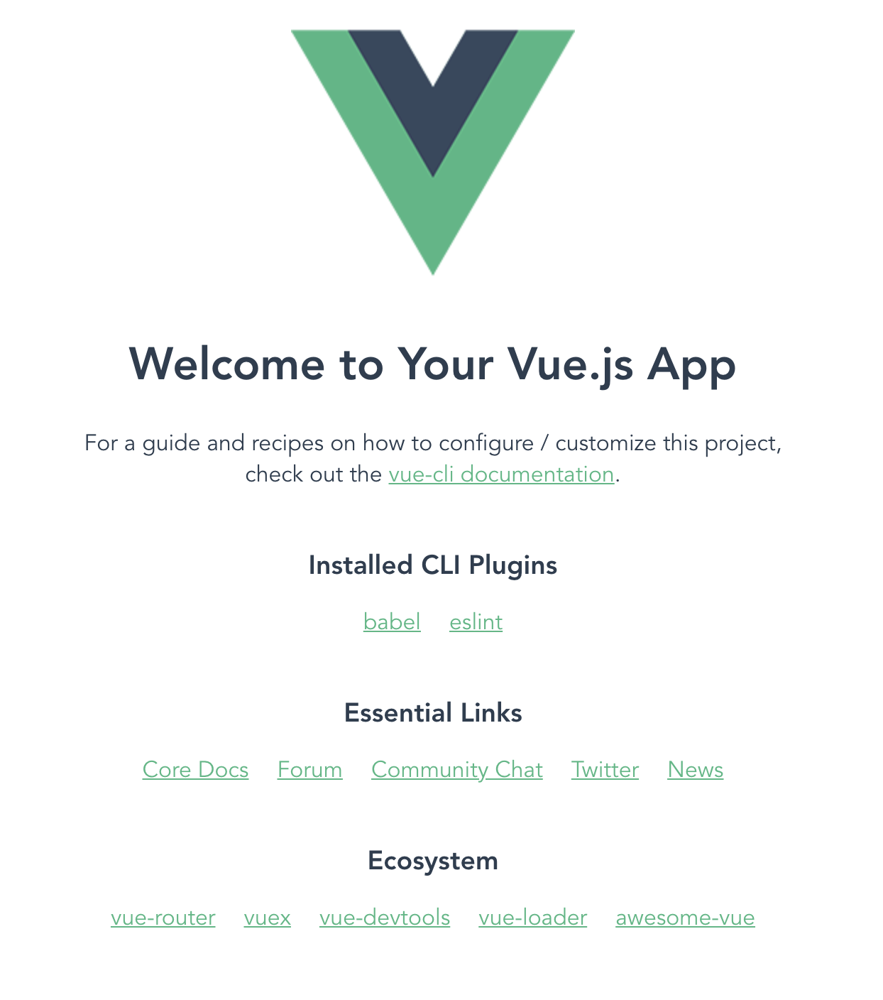

# Creating Your First Vue App

## Intro

VueJS is a JavaScript Framework that allows developers to more easily build user interfaces through JavaScript.  I like Vue because it is easier to use when I want to make dynamic and interactive webpages.

## Create an app with 3 commands

If you have a Node package manager installed globally (i.e. - NPM or Yarn), you can create your first Vue App in as little as three terminal commands.  I will show the process using Yarn:

 1. Install the `@vue/cli` package globally:
```
yarn global add @vue/cli
```
 2. Create the Vue app and `cd` into the app's root directory (you can change your app's name by replacing `app` with your desired name):
```
vue create app && cd app
```
 3. Serve the Vue app using the Vue CLI:
```
yarn serve
```

You should see some terminal output that looks like the this:
```
 DONE  Compiled successfully in 4359ms                                       8:31:51 PM


  App running at:
  - Local:   http://localhost:8080/ 
  - Network: http://<YOUR_LOCAL_IP_ADDRESS>:8080/

  Note that the development build is not optimized.
  To create a production build, run npm run build.
```

And if you go to http://localhost:8080 in your browser, you should see a webpage that looks like this:



## Outtro

Congratulations on building your first Vue app!  Follow for more content about changing your Vue page to make it the way you want it.